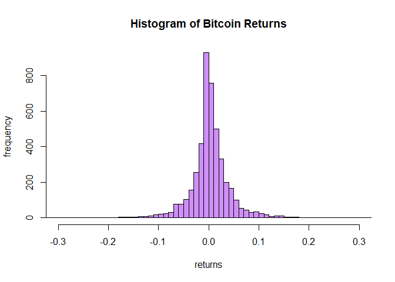
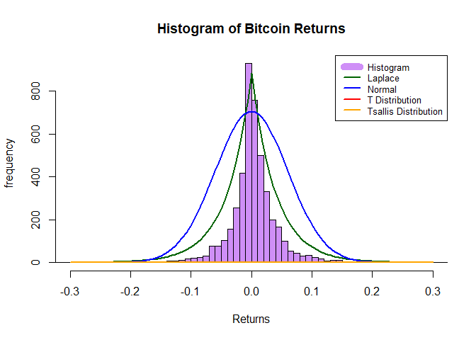

SA 2
================
Cuerdo, Naomi Hannah A., Morillo, Jade Marco
2024-05-11

# “Bitcoin Change Distribution Analysis”

#### Find out which probability distribution function best fits Bitcoin’s returns for trading data every minute, from January 1, 2012 to April 15, 2024, for Bitcoin quoted in United States dollars or the BTC/USD pair.

The data for 1 minute returns is accessible, so the data presented is
for 1 day returns.

##### Setting up the data frame

``` r
df_btc <- read.csv("C:/Users/naomi/Documents/SA2_Cuerdo_Morillo/1day_BTC_USD.csv")
summary(df_btc)
```

    ##      Date              Price               Open               High          
    ##  Length:4489        Length:4489        Length:4489        Length:4489       
    ##  Class :character   Class :character   Class :character   Class :character  
    ##  Mode  :character   Mode  :character   Mode  :character   Mode  :character  
    ##      Low                Vol.              Change         
    ##  Length:4489        Length:4489        Length:4489       
    ##  Class :character   Class :character   Class :character  
    ##  Mode  :character   Mode  :character   Mode  :character

##### Histogram of Returns

``` r
df_btc$Change <- as.numeric(gsub("%", "", df_btc$Change)) / 100
x_limits <- c(-0.3, 0.3)
# Histogram
hist(df_btc$Change, 
     main = "Histogram of Percent Change", 
     xlab = "returns", 
     ylab = "frequency ", 
     col = alpha("purple", 0.5),  # Adjust transparency
     breaks = 500,  # Reduce breaks for better visibility
     xlim = x_limits)
```

<!-- -->

Given the histogram, we can now proceed to conduct the Kolmogrov-Smirnov
(KS) Test. The smallest KS resuly will be the best fit for the data.

##### Kolmogrov-Smirnov Test

##### Normal Distribution

``` r
# Normal Distribution
cleaned_data <- na.omit(df_btc$Change)
fit <- fitdist(cleaned_data, "norm")
random_sample <- rnorm(length(cleaned_data), mean = fit$estimate[1], sd = fit$estimate[2])
cleaned_data <- jitter(cleaned_data)
ks_result1 <- ks.test(cleaned_data, random_sample)
print(ks_result1)
```

    ## 
    ##  Two-sample Kolmogorov-Smirnov test
    ## 
    ## data:  cleaned_data and random_sample
    ## D = 0.19715, p-value < 2.2e-16
    ## alternative hypothesis: two-sided

##### T Distribution

``` r
# T Distribution
random_sample <- rt(length(cleaned_data), length(cleaned_data)-1)
ks_result2 <- ks.test(cleaned_data, random_sample)
print(ks_result2)
```

    ## 
    ##  Two-sample Kolmogorov-Smirnov test
    ## 
    ## data:  cleaned_data and random_sample
    ## D = 0.44977, p-value < 2.2e-16
    ## alternative hypothesis: two-sided

##### Laplace Distribution

``` r
laplace_pdf <- function(x, mu, b) {
  exp(-abs(x - mu) / b) / (2 * b)
}

laplace_cdf <- function(x, mu, b) {
  integrate(laplace_pdf, lower = -Inf, upper = x, mu = mu, b = b)$value
}

laplace_cdf_data <- sapply(df_btc$Change, function(x) laplace_cdf(x, mu = 0, b = 0.04))

ks_result_laplace <- ks.test(laplace_cdf_data, punif)
```

    ## Warning in ks.test(laplace_cdf_data, punif): default ks.test() cannot compute correct p-values with ties;
    ##  see help page for one-sample Kolmogorov test for discrete distributions.

##### Tsallis Distribution

``` r
df_test <- rtsal(length(na.omit(df_btc$Change)), mean(na.omit(df_btc$Change)), sd(na.omit(df_btc$Change)))
jittered_data <- jitter(na.omit(df_btc$Change))
ks_result4 <- ks.test(jittered_data, df_test)
```

    ## Warning in ks.test(jittered_data, df_test): cannot compute correct p-values
    ## with ties

``` r
print(ks_result4)
```

    ## 
    ##  Two-sample Kolmogorov-Smirnov test
    ## 
    ## data:  jittered_data and df_test
    ## D = 0.99332, p-value < 2.2e-16
    ## alternative hypothesis: two-sided

## Results

``` r
cat("Normal:", ks_result1$statistic, "\n")
```

    ## Normal: 0.1971486

``` r
cat("T- Distribution:", ks_result2$statistic, "\n")
```

    ## T- Distribution: 0.4497661

``` r
cat("Laplace:", ks_result_laplace$statistic, "\n")
```

    ## Laplace: 0.1247626

``` r
cat("TSALLIS:", ks_result4$statistic, "\n")
```

    ## TSALLIS: 0.993317

Given that the Laplace has the smallest value, Laplace will be the best
probability distribution to describe Bitcoin’s returns for trading on a
daily basis, followed by the Normal Distribution.

For better visualiztion, here is the Graph for the Probability
Distribution that describes the data:

``` r
# Histogram
hist(df_btc$Change, 
     main = "Histogram of Bitcoin Returns", 
     xlab = "Returns", 
     ylab = "frequency", 
     col = alpha("purple", 0.5),
     breaks = 500,
     xlim = x_limits)
#Laplace
laplace_shift <- function(x) {
  laplace_pdf(x, mu = 0, b = 0.04) * length(df_btc$Change) * diff(range(df_btc$Change)) / 250
}

curve(laplace_shift(x),
      from = x_limits[1], 
      to = x_limits[2], 
      add = TRUE, 
      col = "darkgreen", 
      lwd = 2)
#Normal 
shifted_normal_pdf <- function(x) {
  dnorm((x) / 0.06) * length(df_btc$Change) * diff(range(df_btc$Change)) / 10
}
curve(shifted_normal_pdf(x), 
      from = x_limits[1], 
      to = x_limits[2], 
      add = TRUE, 
      col = "blue", 
      lwd = 2)
# T Distribution
curve(dt(x, length(cleaned_data) - 1), 
      from = x_limits[1], 
      to = x_limits[2], 
      add = TRUE, 
      col = "red", 
      lwd = 2)
#Tsallis Distribution
curve(dtsal(x, mean(na.omit(df_btc$Change)), sd(na.omit(df_btc$Change))), 
      from = x_limits[1], 
      to = x_limits[2], 
      add = TRUE, 
      col = "orange", 
      lwd = 2)

legend("topright",
       legend = c("Histogram", "Laplace", "Normal", "T Distribution", "Tsallis Distribution"),
       col = c((alpha("purple", 0.5)), "darkgreen", "blue", "red", "orange"),
       lwd = c(10, 2, 2, 2, 2), 
       lty = c(1, 1, 1, 1, 1), 
       cex = 0.8)
```

<!-- -->

From here, it is evident that Laplace best fits the data of Bitcoin
Returns on a daily basis.
