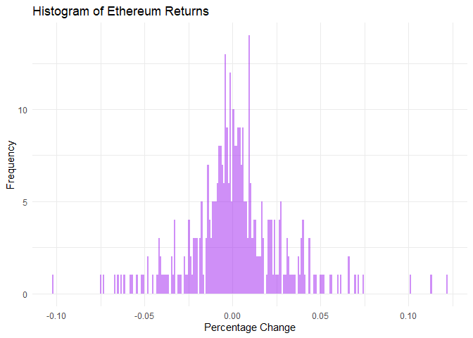

SA2
================
MORILLO, JADE MARCO S. & CUERDO, NAOMI HANNAH A.
2024-05-08

## R Markdown

Test using Shapiro-Wilk normality test the Ethereum returns for trading
data every five minutes, from August 7, 2015 to April 15, 2024.

The data for 5-minute returns is inaccessible, so the data presented is
for 1 day returns.

``` r
# Load necessary packages
library(dplyr)
```

    ## 
    ## Attaching package: 'dplyr'

    ## The following objects are masked from 'package:stats':
    ## 
    ##     filter, lag

    ## The following objects are masked from 'package:base':
    ## 
    ##     intersect, setdiff, setequal, union

``` r
library(readr)
library(ggplot2)

# Read the CSV file with column specification
eth_data <- read_csv("C:/Users/Dindette/Downloads/ETH-USD.csv", col_types = cols())

# Calculate returns
eth_data <- eth_data %>%
  mutate(Return = (Close - lag(Close)) / lag(Close))

# Calculate data range and binwidth
data_range <- range(eth_data$Return, finite = TRUE)
if (length(data_range) != 2 || any(!is.finite(data_range))) {
  stop("Data range contains non-finite values.")
}
binwidth <- (data_range[2] - data_range[1]) / 250

# Plot histogram of returns with breaks set to 250
histogram <- ggplot(eth_data, aes(x = Return)) +
  geom_histogram(binwidth = binwidth, breaks = seq(data_range[1], data_range[2], by = binwidth), fill = "purple", alpha = 0.5) +
  labs(title = "Histogram of Ethereum Returns", x = "Percentage Change", y = "Frequency") +
  theme_minimal()

# Perform Shapiro-Wilk normality test
shapiro_test_result <- shapiro.test(eth_data$Return)

# Print histogram plot and test result
print(histogram)
```

    ## Warning: Removed 1 rows containing non-finite values (`stat_bin()`).

<!-- -->

``` r
print(shapiro_test_result)
```

    ## 
    ##  Shapiro-Wilk normality test
    ## 
    ## data:  eth_data$Return
    ## W = 0.94864, p-value = 5.694e-10

``` r
# While the W value is not far from 1, the p-value indicates that the data is unlikely to be normally distributed according to the Shapiro-Wilk test. This is true as cryptocurrencies such as ethereum tend to be volatile and display occasional extreme fluctuations.
```
